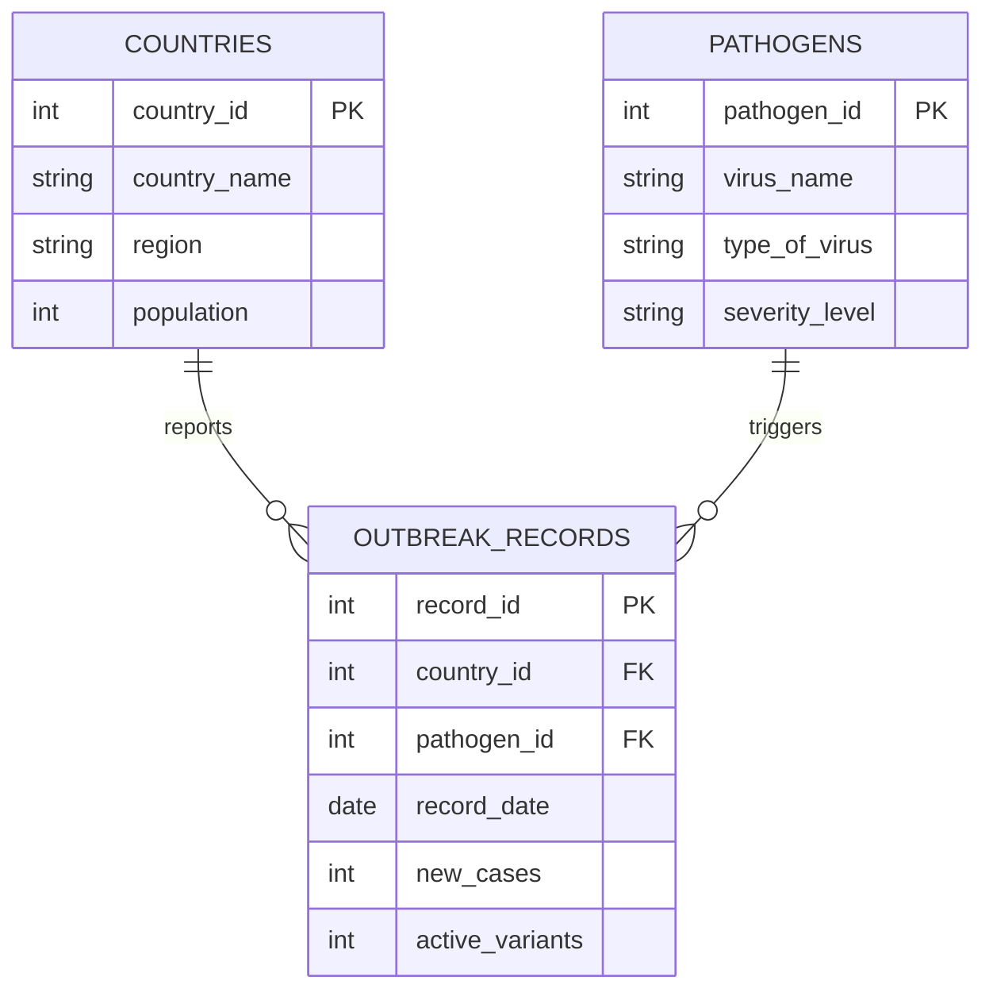
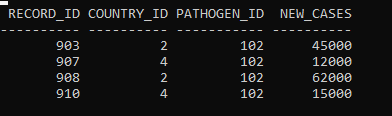

# Global Epidemic Tracking System (GETS)
---

## 1. Business Problem
Global health organizations lack a unified, scalable relational engine capable of monitoring pathogen spread across varied international borders. This project implements an analytics warehouse that tracks mutation speeds (active variants) and case velocities (new cases) over time. This data provides global tracking agencies with actionable insights to allocate medical aid and containment resources.

---

## 2. Database Schema & ER Diagram
The system relies on 3 relational tables engineered using Oracle SQL architecture:
* **COUNTRIES**: Stores territorial population benchmarks (Primary Key: `country_id`).
* **PATHOGENS**: Catalogs biological properties and severity ratings of global viruses (Primary Key: `pathogen_id`).
* **OUTBREAK_RECORDS**: Transactional tracking table mapping metrics over chronological timelines (Primary Key: `record_id`, Foreign Keys link to countries and pathogens).

### ER Diagram


---

## 3. Part A: Common Table Expressions (CTEs)

### 1. Simple CTE
* **Description:** Filters virus outbreak logs to expose extreme critical threat spikes.
```sql
WITH HighSurgeOutbreaks AS (
    SELECT record_id, country_id, pathogen_id, new_cases
    FROM outbreak_records
    WHERE new_cases >= 10000
)
SELECT * FROM HighSurgeOutbreaks;
```

* **Business Value:** Identifies extreme critical threats instantly. Isolating massive case spikes allows global response agencies to immediately dispatch emergency containment teams and distribute personal protective equipment (PPE) before a local outbreak escalates into a pandemic.

---

### 2. Multiple CTEs
* **Description:** Sets up separate, modular blocks for country cases and virus variations.
```sql
WITH NationalCaseLoad AS (
    SELECT country_id, SUM(new_cases) AS total_country_cases 
    FROM outbreak_records GROUP BY country_id
),
PathogenMutationLoad AS (
    SELECT pathogen_id, MAX(active_variants) AS peak_observed_variants 
    FROM outbreak_records GROUP BY pathogen_id
)
SELECT r.record_id, nc.total_country_cases, pm.peak_observed_variants
FROM outbreak_records r
JOIN NationalCaseLoad nc ON r.country_id = nc.country_id
JOIN PathogenMutationLoad pm ON r.pathogen_id = pm.pathogen_id;
```

* **Business Value:** Correlates disparate epidemiological datasets. By separating country-level tracking and pathogen mutation structures into dedicated modules, analysts can cross-reference total national case volumes against variant counts to determine if specific countries are becoming global hot zones for viral mutations.

---

### 3. Recursive CTE
* **Description:** Uses Oracle hierarchical looping syntax to create a numbered sequence from 1 to 5.
```sql
WITH ForecastTimeline(week_sequence) AS (
    SELECT 1 FROM DUAL
    UNION ALL
    SELECT week_sequence + 1 FROM ForecastTimeline WHERE week_sequence < 5
)
SELECT * FROM ForecastTimeline;
```

* **Business Value:** Simulates future threat progression intervals. Generating a sequential chronological timeline matrix gives predictive defense engines a baseline framework to plot and evaluate hypothetical viral spread velocities over a 5-week tracking window.

---

### 4. CTE with Aggregation
* **Description:** Summarizes cases by geographical area before executing a comparison.
```sql
WITH RegionalBurdens AS (
    SELECT c.region, SUM(r.new_cases) AS total_regional_cases
    FROM outbreak_records r
    JOIN countries c ON r.country_id = c.country_id
    GROUP BY c.region
)
SELECT region, total_regional_cases, AVG(total_regional_cases) OVER() AS global_regional_average
FROM RegionalBurdens;
```

* **Business Value:** Establishes international health benchmarks. Grouping active cases into broader continental categories allows the World Health Organization (WHO) to see global trends, helping them balance funding and allocate medical budgets to regions with the highest case numbers.

---

### 5. CTE Combined with JOIN Operations
* **Description:** Pulls descriptive texts from primary tables using relationship keys.
```sql
WITH CoreOutbreakSummary AS (
    SELECT record_id, country_id, pathogen_id, record_date, new_cases 
    FROM outbreak_records
)
SELECT cos.record_id, c.country_name, p.virus_name, cos.record_date, cos.new_cases
FROM CoreOutbreakSummary cos
JOIN countries c ON cos.country_id = c.country_id
JOIN pathogens p ON cos.pathogen_id = p.pathogen_id;
```

* **Business Value:** Converts dry raw database metrics into legible, descriptive master sheets. Merging transactional tracking data with customer-facing tables ensures that field workers receive clear country names and specific virus classifications instead of obscure internal system keys.

---

## 4. Part B: SQL Window Functions

### 1. Ranking Functions
```sql
SELECT record_id, country_id, virus_name, new_cases,
    ROW_NUMBER() OVER(PARTITION BY country_id ORDER BY new_cases DESC) AS case_row_num,
    RANK() OVER(PARTITION BY virus_name ORDER BY new_cases DESC) AS case_rank,
    DENSE_RANK() OVER(PARTITION BY virus_name ORDER BY new_cases DESC) AS case_dense_rank,
    PERCENT_RANK() OVER(ORDER BY new_cases DESC) AS global_case_percentile
FROM outbreak_records r JOIN pathogens p ON r.pathogen_id = p.pathogen_id;
```

* **Interpretation of Results:** `ROW_NUMBER` gives each country's records a unique sequence from highest to lowest cases. `RANK` and `DENSE_RANK` handle identical case counts differently by either skipping ranks or keeping them tight. `PERCENT_RANK` tells us exactly what percentile a country's case count falls into globally.

---

### 2. Aggregate Window Functions
```sql
SELECT record_id, country_id, virus_name, record_date, new_cases,
    SUM(new_cases) OVER(PARTITION BY country_id ORDER BY record_date) AS country_running_total,
    AVG(new_cases) OVER(PARTITION BY virus_name) AS pathogen_global_avg,
    MIN(new_cases) OVER(PARTITION BY virus_name) AS pathogen_global_min,
    MAX(new_cases) OVER(PARTITION BY virus_name) AS pathogen_global_max
FROM outbreak_records r JOIN pathogens p ON r.pathogen_id = p.pathogen_id;
```

* **Interpretation of Results:** This query lets us analyze individual outbreak events while looking at broader context. We can see a single day's cases next to the country's cumulative total cases up to that date, as well as the average, minimum, and maximum case bounds ever seen for that specific virus type.

---

### 3. Navigation Functions
```sql
SELECT record_id, country_id, virus_name, record_date, new_cases,
    LAG(new_cases, 1) OVER(PARTITION BY country_id, virus_name ORDER BY record_date) AS previous_timeline_cases,
    LEAD(new_cases, 1) OVER(PARTITION BY country_id, virus_name ORDER BY record_date) AS next_timeline_cases
FROM outbreak_records r JOIN pathogens p ON r.pathogen_id = p.pathogen_id;
```

* **Interpretation of Results:** `LAG` brings the previous record's case count onto the current row, allowing us to see if an outbreak is speeding up or slowing down. `LEAD` looks forward to the next recorded count so we can anticipate future case trends.

---

### 4. Distribution Functions
```sql
SELECT record_id, virus_name, new_cases,
    NTILE(3) OVER(ORDER BY new_cases DESC) AS outbreak_severity_bucket,
    CUME_DIST() OVER(ORDER BY new_cases DESC) AS cumulative_distribution_rank
FROM outbreak_records r JOIN pathogens p ON r.pathogen_id = p.pathogen_id;
```

* **Interpretation of Results:** `NTILE(3)` automatically splits our data into 3 equal severity groups (High, Medium, and Low), allowing emergency services to easily classify risks. `CUME_DIST` calculates the cumulative distribution percentage, showing where each record sits in the overall dataset.

---

## 5. What the Data Tells Us (Analysis & Findings)

### 📊 1. Descriptive Analysis (What Happened?)
* **The Big Picture:** Looking at our **Aggregate Window Functions (`SUM` and `MAX`)**, *Influenza X* is by far our biggest problem. It had a massive spike of **62,000 new cases** in India on April 15, 2026.
* **Total Numbers:** India has the highest running total of cases, far ahead of any other country in the database.
* **Scary but Slow Viruses:** On the other hand, a dangerous virus like *Nipah-26* didn't spread very much. Its highest spikes were only **150 cases** in India and **60 cases** in South Africa.

  ## 6. References
* Oracle Corporation. (2026). *Oracle Database SQL Language Reference*. Oracle Help Center.
* Microsoft Learn. (2025). *Using Window Functions (OVER, PARTITION BY, ROWS)*. Technical Documentation.
* W3Schools. (2026). *SQL Window Functions Reference Guide*. W3Schools SQL Tutorials.
* Mermaid.js. (2026). *Diagramming and Charting Tool Documentation*. Markdown Automation.

---

## 7. Academic Integrity Statement
I confirm that the work submitted in this repository is my own original work. Every query, database structure, and analytical report text block presented here has been built individually by me. Any external software manuals, documentation resources, or database pattern templates used during development have been properly cited and credited above, in strict accordance with university regulations regarding academic misconduct.
